# AgentProbe — 技术架构

**版本:** 架构 v0.2.0 · 契约 v0.2.0
**状态:** Authoritative（本文件是 AgentProbe 技术架构的唯一权威来源）
**范围:** 本文件只描述**技术架构**——模块分解、接口契约、数据流、硬件/固件/主机协同。产品动机、市场与商业内容见 [`archive/`](archive/README.md) 中的历史 PRD。

---

## 0. 目录

1. [Purpose & Scope](#1-purpose--scope)
2. [架构原则](#2-架构原则)
3. [C4 L1 — System Context](#3-c4-l1--system-context)
4. [C4 L2 — Containers](#4-c4-l2--containers)
5. [Host 软件架构](#5-host-软件架构)
6. [Device 架构（Zynq-7020）](#6-device-架构zynq-7020)
7. [★ Mock Engine（差异化核心）](#7--mock-engine差异化核心)
8. [基础能力层（SWD / 逻辑分析仪 / UART）](#8-基础能力层swd--逻辑分析仪--uart)
9. [数据平面](#9-数据平面)
10. [契约层（SSOT）](#10-契约层ssot)
11. [Self-Hosting Loop](#11-self-hosting-loop)
12. [演化与分层](#12-演化与分层)
13. [仓库目录 → 模块映射](#13-仓库目录--模块映射)
14. [横切关注点](#14-横切关注点)
15. [AI-Native 服务分层与演化座位](#15-ai-native-服务分层与演化座位)

---

## 1. Purpose & Scope

AgentProbe 是面向 AI Agent 的嵌入式物理验证基础设施。它把物理世界的总线、时序、外设响应与异常翻译成确定性、可消费的语义 JSON（观测面），并把烧录、Mock 外设、信号采集、诊断与验证控制收敛成一个**无头(headless)能力服务核心**（执行面）。

这个核心对外只暴露一条 transport-agnostic 的稳定语义契约;**CLI、GUI、MCP 都是绑定到该契约上的平级客户端**,没有哪个是产品本体或唯一接口(P9 / §15)。V1 以 CLI + 本地 daemon 落地,GUI 作为人类监督/分析客户端保留,MCP 是顺手支持的一种 transport binding。**推理层(Agent 大脑 / RAG / 长期记忆)挂在契约之上、可替换:V1 不实现,但架构为它预留座位(§15)。**

**V1 North Star — two-board self-hosting loop:** 一块已知稳定的 *Golden AgentProbe* 帮助 Agent 开发、烧录、观测、诊断并修复一块 *DUT AgentProbe*,全程产出可审计证据。

本架构有两类一等模块,**技术深度都要做到位**:

| 类别 | 模块 | 定位 |
|------|------|------|
| **差异化核心(护城河)** | **Mock Engine** | 可编程外设模拟器。让 Agent 在无真实外设时声明式定义/修改被模拟外设行为,获得确定性、带保真度声明的总线响应。这是 AgentProbe 区别于 J-Link/Saleae/Bus Pirate 的根本。 |
| **基础能力(地基)** | SWD/烧录、逻辑分析仪、UART | 市面成熟能力的高质量集成。是闭环的地基,**必须完整扎实**,不是薄壳。 |

## 2. 架构原则

这些原则是不可妥协的设计约束,后续所有模块设计都必须可追溯到它们。

| ID | 原则 | 含义 |
|----|------|------|
| **P1** | 双数据平面分离 | 控制平面(Agent→硬件)低频、ms 级、必须可靠、请求/响应;观测平面(硬件→Agent)高频、高吞吐、可容忍少量丢失、单向事件流。两条流在 USB 端点、PS 固件、主机软件三层都独立。 |
| **P2** | Contract-first SSOT | `protocol.toml` 与 `address_map.toml` 是跨域单一真相源,经代码生成产出 Python/C/Verilog 常量,并以 sha256 hash 强校验,杜绝跨域常量漂移。 |
| **P3** | Transport 抽象 + replay parity | USB / Replay / Mock 三种 transport 实现同一接口;replay 必须与硬件 transport 上层行为一致,使闭环逻辑可在无硬件下被测试。 |
| **P4** | 硬实时下沉到 PL | Mock 协议层响应 <1μs、8ch@100MHz 采样、触发/压缩都在 PL(FPGA)硬实时完成,绝不依赖 PS/PC 软件时序。 |
| **P5** | 身份门控的状态变更 | 所有 state-changing action(flash/reset/drive_pin/mock_start/stop/firmware_update/bitstream_update)必须绑定 device identity + topology;缺字段返回 `unknown` / `approval_pending`,绝不输出成功 verdict;**Agent 不得自动升级 Golden**。 |
| **P6** | Layer A 永不破坏,Layer D 随时可换 | Agent 依赖的契约层(终态/证据/诊断/Skill 格式)从 V1 起稳定;硬件实现层(Zynq-7020 → UltraScale+ → …)可替换而不破坏上层。 |
| **P7** | Mock 行为 = 数据,而非门级逻辑 | Mock 外设行为由声明式模型(寄存器表 + 状态机 + 时序参数)描述。改行为 = 写寄存器(μs 级,**不重综合 bitstream**);声明无法表达的复杂行为下沉到 PC Behavior Layer 的脚本逃生舱。 |
| **P8** | Mock 保真度可声明、不可冒充 | 任何 mock 产出的证据必须携带 `mock_fidelity` provenance,声明其行为模型级别(L1–L4),**不得等同真实硬件验证结论**。V1 只做声明;mock-vs-real 自动分歧检测为 planned。 |
| **P9** | 能力面与推理面分离,客户端平级 | **能力服务层是无头(headless)核心**,对外只暴露一条 transport-agnostic 的稳定语义契约(Capability / Evidence / Verdict)。CLI、GUI、MCP 是绑定到该契约上的**平级客户端**,没有哪个是"the API";MCP 只是一种 transport binding。真相源是**声明式文件 + 证据库**,而非任何一次 RPC/工具调用。推理层(Agent 大脑 / RAG / 记忆)挂在契约之上、可替换,V1 不实现但预留座位(详见 §15)。 |

## 3. C4 L1 — System Context

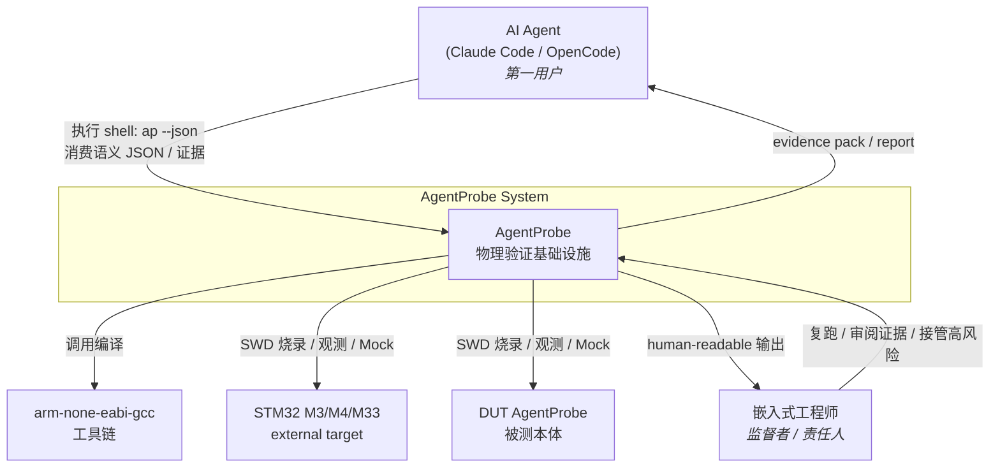

**关键边界:** Agent 是第一用户,消费确定性 `--json` 输出 + 证据;工程师是监督者,消费 human-readable 输出并审阅相同证据。AgentProbe 把"手和眼"做成**无头能力服务核心**,V1 通过 CLER + 本地 daemon 暴露;V1 不自研推理层(Agent 大脑),而是服务现成 Agent,并为未来自研推理层/RAG 预留契约座位(§15)。GUI 与 MCP 是平级客户端(GUI 现可选,MCP 顺手支持)。

---

## 4. C4 L2 — Containers

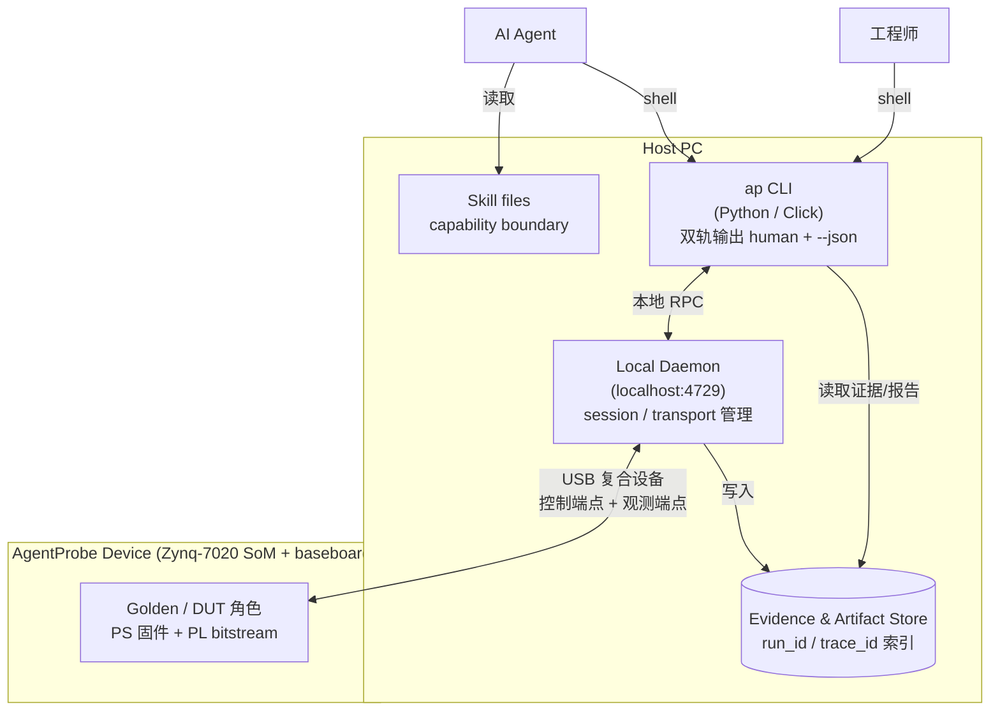

| Container | 技术 | 职责 |
|-----------|------|------|
| `ap` CLI | Python + Click | 命令面,双轨输出(human 默认 / `--json` Agent 模式) |
| Local Daemon | Python,localhost 服务 | session 生命周期、transport 选择(USB/Replay/Mock)、设备注册表、事件流聚合 |
| Evidence & Artifact Store | 本地文件系统 | 按 `run_id`/`trace_id` 存储 Evidence Envelope、原始事件、artifacts |
| Skill files | Markdown + schema | 向 Agent 声明 `supported` / `not_supported` / `planned` 能力边界 |
| AgentProbe Device | Zynq-7020 SoM + minimal baseboard | PS 固件 + PL bitstream,提供 SWD/观测/Mock/事件/证据通道 |

## 5. Host 软件架构

### 5.1 模块分解

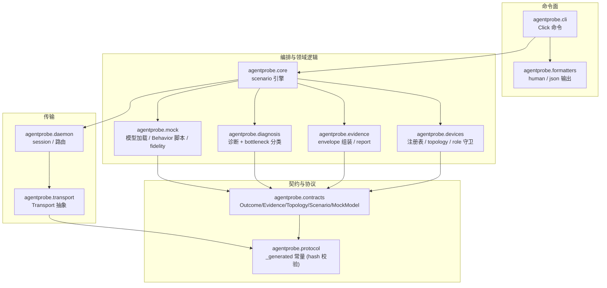

### 5.2 模块职责与接口

| 模块 | 职责 | 关键接口 |
|------|------|---------|
| `agentprobe.cli` | Click 命令面,双轨输出 | `ap <group> <cmd> [--json]` |
| `agentprobe.formatters` | human vs json 渲染,二者语义对齐 | `emit(payload, json: bool)` |
| `agentprobe.protocol` | 由 SSOT 生成的消息/事件/错误常量 | `protocol._generated`(导入时 hash 校验) |
| `agentprobe.contracts` | Outcome / EvidenceEnvelope / Topology / Scenario / **MockModel** 数据类 + schema 校验 | `validate()`, `from_dict()` |
| `agentprobe.mock` | **Mock 模型加载/校验、Behavior Layer 脚本宿主、配置下发、fidelity provenance** | `load_model()`, `configure(model)`, `fidelity()` |
| `agentprobe.transport` | 抽象 Transport 接口 + USB/Replay/Mock 实现 | `request(msg)`, `stream_events()`, `info()` |
| `agentprobe.devices` | 设备注册表、身份、topology validator、role 守卫 | `resolve(role)`, `assert_can(action, device)` |
| `agentprobe.core` | scenario 编排,驱动闭环 | `run_scenario()`, `run_replay_scenario()` |
| `agentprobe.diagnosis` | diagnose 引擎,bottleneck 分类 | `diagnose(evidence)` |
| `agentprobe.evidence` | evidence pack 组装、envelope、report 渲染 | `build_envelope()`, `render_report()` |
| `agentprobe.daemon` | 本地守护进程,session 管理 | localhost 服务 |

### 5.3 Transport 抽象

P3 要求 USB / Replay / Mock 三实现同一接口,且 replay 与硬件上层行为一致。

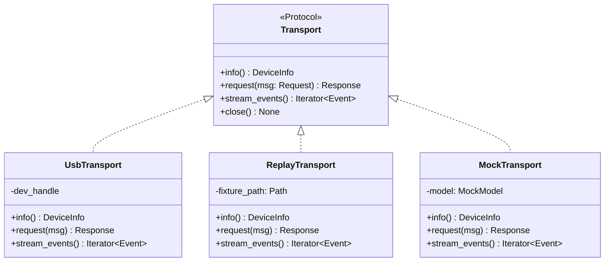

- **UsbTransport** — 真实硬件,通过 USB 复合设备的控制/观测端点。
- **ReplayTransport** — 回放 canonical fixture(无硬件),用于闭环逻辑测试与 CI;输出与 USB 上层结构一致(replay parity)。
- **MockTransport** — 纯软件仿真整设备行为,用于上层开发。

## 6. Device 架构（Zynq-7020）

Zynq-7020 = PS(双核 Cortex-A9 处理系统)+ PL(Artix-7 等价可编程逻辑,~85K LUT)。AgentProbe 把**硬实时**任务放 PL,**控制/命令**放 PS,**复杂行为**(可选)放 PC。

### 6.1 PS / PL 分工

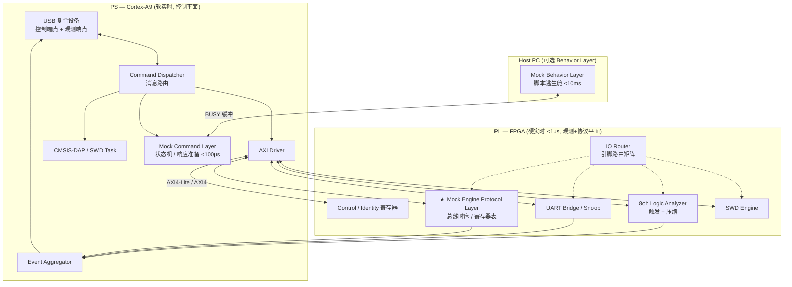

### 6.2 PL 组件

| 组件 | 职责 | AXI 区 |
|------|------|--------|
| Control / Identity 寄存器 | identity、protocol/fw/bitstream version、device_role、topology_hash、status、error_code | `control` @ 0x4000_0000 |
| IO Router | 引脚路由矩阵,role-safe 路由配置 | `io_router` @ 0x4000_1000 |
| **★ Mock Engine Protocol Layer** | 总线时序、ACK/NAK/BUSY、寄存器表查找(详见 §7) | `spi_mock` @ 0x4000_6000 |
| 8ch Logic Analyzer | 100MHz 采样、触发(mask/value)、压缩、事件 FIFO(详见 §8.2) | `logic_analyzer` @ 0x4000_3000 |
| UART Bridge / Snoop | 透传/嗅探、波特率、FIFO(详见 §8.3) | `uart_bridge` @ 0x4000_5000 |
| SWD Engine | CMSIS-DAP/SWD 引擎控制(详见 §8.1) | `swd` @ 0x4000_2000 |

### 6.3 PS 组件

| 组件 | 职责 |
|------|------|
| USB 复合设备 | 控制端点(请求/响应)+ 观测端点(事件流),对应 P1 双平面 |
| Command Dispatcher | 解析 `message_types`,路由到 DAP / Mock / AXI |
| AXI Driver | PS↔PL 寄存器读写 |
| Event Aggregator | 汇聚 PL 各源事件(`uart_frame`/`logic_edge`/`spi_transaction`…)到观测端点 |
| CMSIS-DAP / SWD Task | 烧录/调试控制(详见 §8.1) |
| **Mock Command Layer** | Mock 命令解析、简单状态机、响应数据准备 <100μs(详见 §7.2) |

### 6.4 AXI 地址映射(摘自 `address_map.toml` SSOT)

| 区 | base | size | 说明 |
|----|------|------|------|
| control | `0x4000_0000` | `0x1000` | 全局控制、身份、版本、状态寄存器 |
| io_router | `0x4000_1000` | `0x1000` | 引脚路由矩阵 |
| swd | `0x4000_2000` | `0x1000` | CMSIS-DAP/SWD 引擎控制 |
| logic_analyzer | `0x4000_3000` | `0x2000` | 8ch 采样配置与状态 |
| uart_bridge | `0x4000_5000` | `0x1000` | UART 桥接/嗅探配置与 FIFO |
| spi_mock | `0x4000_6000` | `0x2000` | SPI slave mock 配置、寄存器模型、事务状态 |

> 地址在 `0x4000_4000`(la 区尾)与 `0x4000_5000` 之间、以及 `0x4000_8000` 之后留有 gap,供后续 mock 类型(I2C/CAN/…)与新能力扩展,不破坏既有映射。

## 7. ★ Mock Engine（差异化核心）

Mock Engine 是 AgentProbe 的护城河:让 Agent 在**没有真实外设芯片**的情况下,声明式地定义/修改一个被模拟外设的行为,并获得**确定性、可观测、带保真度声明**的总线响应。J-Link/Saleae/Bus Pirate 都假设人来操作和判断;Mock Engine 把"外设本身"变成 Agent 可编程的对象。

### 7.1 三层执行模型

按延迟预算把 Mock 行为切成三层(P4 + P7):时序敏感的下沉 PL,复杂状态上浮 PC。

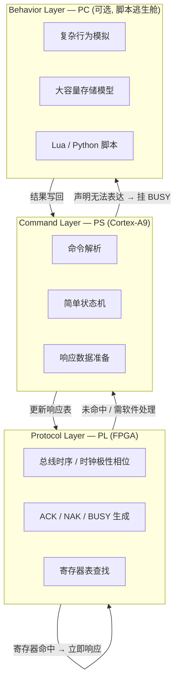

| 层 | 位置 | 职责 | 延迟预算 | 何时触发 |
|----|------|------|---------|---------|
| Protocol Layer | PL (FPGA) | 总线时序、ACK/NAK/BUSY、寄存器表查找 | **<1μs** | 每个总线事务 |
| Command Layer | PS | 命令解析、简单状态机、响应数据准备 | **<100μs** | 寄存器未命中或需软件状态 |
| Behavior Layer | PC(可选) | 复杂行为、大容量存储、模型脚本 | **<10ms**(用 BUSY 缓冲) | 声明式模型无法表达的复杂行为 |

**关键机制:** 当响应需要更久(上浮到 PC)时,Protocol Layer 对总线主机回 BUSY,把延迟掩盖在协议允许的等待窗口内,从而在不破坏总线时序的前提下接入软件级复杂行为。

### 7.2 Mock 模型格式（开源生态格式）

P7 的落地:**声明式数据模型为主 + 脚本逃生舱**。这套格式是开源 Mock 模型生态的格式——版本化、可代码评审、可在团队内复用。

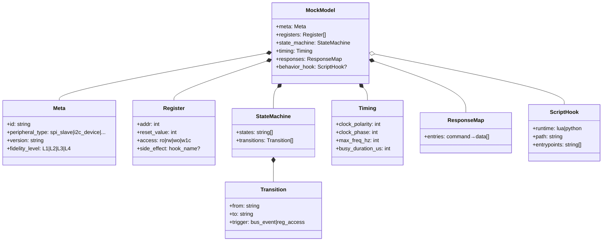

**声明部分**(JSON/YAML/TOML)五要素:`meta`(id/类型/版本/**保真度级别**)、`registers`(寄存器表)、`state_machine`(状态 + 迁移)、`timing`(时序参数)、`responses`(命令→响应查找表)。

**脚本逃生舱**(可选):当声明无法表达复杂状态行为时,引用一个 Lua/Python 脚本,注册到寄存器副作用(`side_effect`)或状态迁移钩子,在 PC Behavior Layer 的 <10ms 预算内运行。

#### 示例 — SPI Flash mock(声明)

```yaml
meta:
  id: spi-nor-flash-w25q32
  peripheral_type: spi_slave
  version: 0.1.0
  fidelity_level: L2          # 见 §7.5
registers:
  - { addr: 0x00, reset_value: 0x00, access: ro }   # status
  - { addr: 0x01, reset_value: 0xEF, access: ro }    # JEDEC manufacturer id
timing:
  clock_polarity: 0
  clock_phase: 0
  max_freq_hz: 50000000
  busy_duration_us: 700        # page program busy
responses:
  entries:
    - { command: 0x9F, data: [0xEF, 0x40, 0x16] }    # RDID → JEDEC id
    - { command: 0x05, data: ["@status"] }            # RDSR → status reg
state_machine:
  states: [IDLE, CMD, ADDR, DATA, BUSY]
  transitions:
    - { from: IDLE, to: CMD,  trigger: "cs_assert" }
    - { from: CMD,  to: ADDR, trigger: "cmd=READ" }
    - { from: ADDR, to: DATA, trigger: "addr_complete" }
    - { from: DATA, to: BUSY, trigger: "cmd=PAGE_PROGRAM" }
    - { from: BUSY, to: IDLE, trigger: "busy_timeout" }
```

#### 示例 — 脚本钩子(逃生舱)

```python
# behavior/w25q32_program.py — 注册到 PAGE_PROGRAM 的 side_effect
def on_page_program(ctx, addr: int, payload: bytes) -> None:
    """复杂行为:写入大容量存储模型并模拟磨损。声明式 responses 无法表达。"""
    ctx.storage[addr:addr + len(payload)] = payload
    ctx.wear[addr // ctx.page_size] += 1
    ctx.set_busy(us=700)        # Protocol Layer 据此对总线回 BUSY
```

### 7.3 SPI Slave Mock 内部结构（PL）

V1 SPI-first。Protocol Layer 在 PL 中的内部结构,映射 `address_map.toml` 的 `spi_mock` 区(`0x4000_6000`):

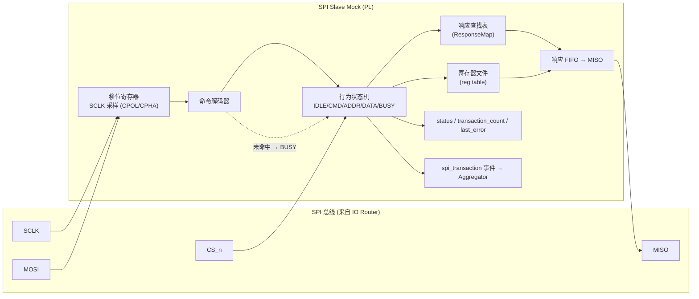

**`spi_mock` 寄存器(摘自 SSOT):** `config`(0x00)、`mode`(0x04)、`max_freq_hz`(0x08)、`status`(0x0C)、`transaction_count`(0x10)、`last_error`(0x14)。PS 的 Mock Command Layer 通过 AXI 写这些寄存器配置行为,通过读取 `status`/`transaction_count` 观测运行状态。

### 7.4 行为状态机（以 SPI Flash 为例）

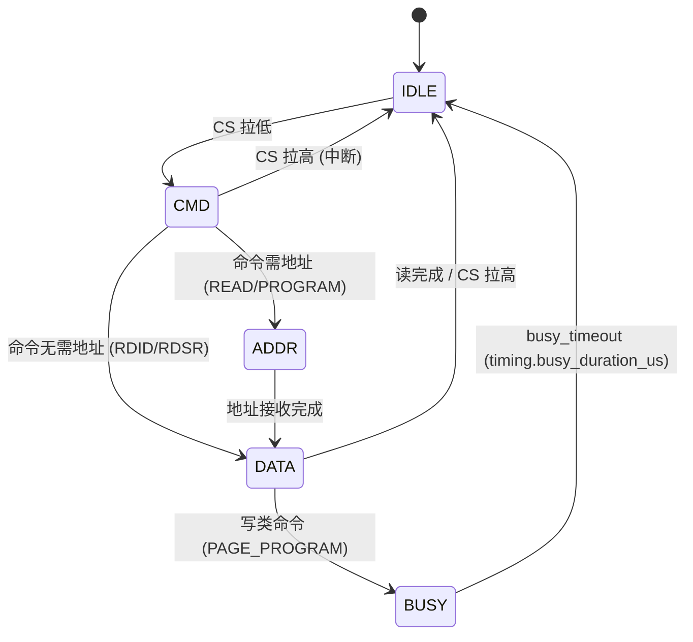

BUSY 态是三层模型的衔接点:声明式 `busy_duration_us` 决定纯时序等待;若挂了 Behavior 脚本,则 BUSY 持续到脚本回写结果(P7 的 <10ms 预算)。

### 7.5 保真度模型（P8）

Mock 结论**不得冒充**真实硬件验证。每个 mock 模型声明一个保真度级别,并把它作为 provenance 注入 Evidence Envelope 的 `mock_fidelity` 字段。

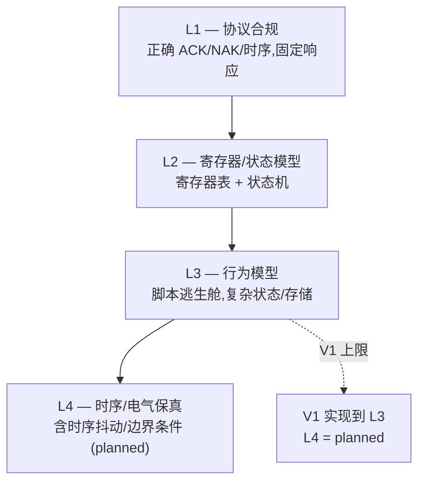

| 级别 | 含义 | V1 |
|------|------|----|
| L1 | 协议合规:正确时序与 ACK/NAK,固定响应 | ✅ |
| L2 | 寄存器 + 状态机模型 | ✅ |
| L3 | 行为模型(脚本逃生舱) | ✅ |
| L4 | 时序/电气保真(抖动、边界条件) | planned |

**provenance 规则:** 任何经 Mock 得出的 `regression_pass`,其 Evidence Envelope 必须带 `mock_fidelity: {level, model_id, model_version}`,并在 verdict 中声明"基于 mock,不等同真实硬件验证"。**mock-vs-real 自动分歧检测(同 scenario 在 mock 与真实外设各跑一次并自动比对)为 planned,V1 不实现。**

### 7.6 Mock 配置与运行时序

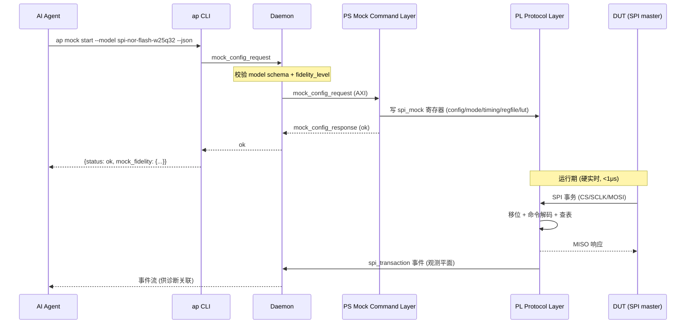

### 7.7 演化预留

I2C / CAN / 1-Wire / PWM mock 走**同一三层模型 + 同一声明格式**,只是 `peripheral_type` 和 Protocol Layer 的总线时序实现不同。新增 mock 类型 = 新 PL 模块 + 新 AXI 区(地址映射已留 gap)+ 同一套 `MockModel` schema。V1 只实现 SPI-first;其余标注为 planned。

## 8. 基础能力层（SWD / 逻辑分析仪 / UART）

这些是闭环的**地基**:成熟能力的高质量集成,**必须完整扎实**。它们与 Mock Engine 同为一等模块,只是定位是基础设施而非差异化创新。

### 8.1 SWD / 烧录（CMSIS-DAP v2）

让 Golden 能识别、烧录、复位、验证 DUT。基于标准 CMSIS-DAP v2,覆盖 Cortex-M 全系列。

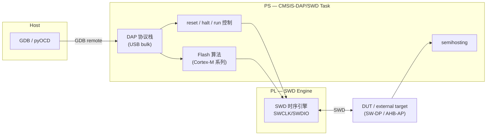

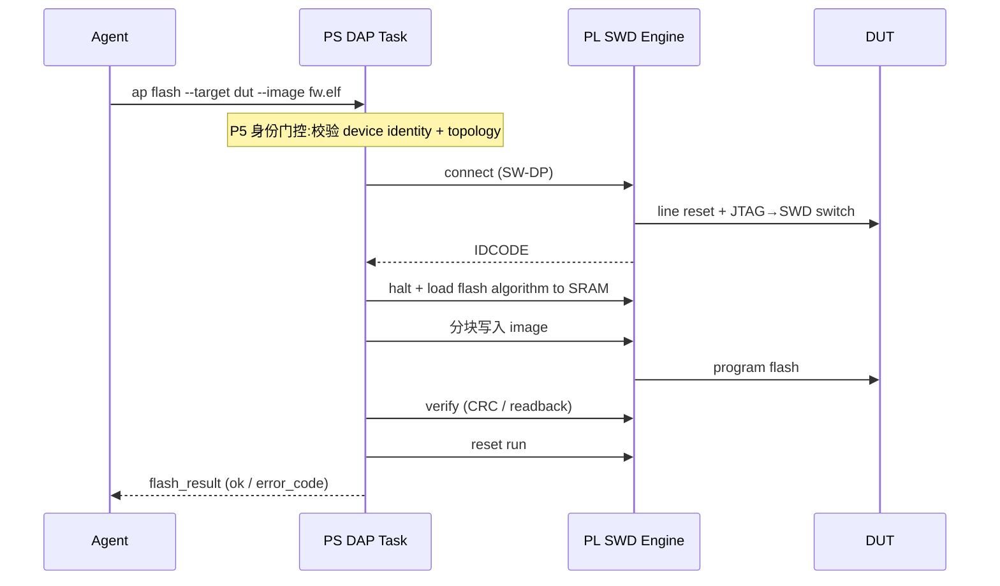

**V1 范围:** SWD + CMSIS-DAP v2 + Cortex-M0/0+/3/4/7/M33 flash/reset/halt/run + GDB/semihosting。**延后:** JTAG、RTT、ITM/DWT trace decode、ETM(V2 内部观测路径)。

### 8.2 8 通道逻辑分析仪 + 协议解码

给 Agent "眼睛":硬实时采样 + 触发 + 压缩 + 解码,把波形变成语义事件。受 USB 带宽硬约束(见 §9),预处理必须在 PL 完成。

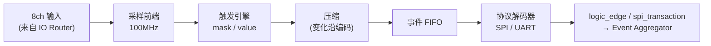

**`logic_analyzer` 寄存器(SSOT):** `config`、`trigger_mask`、`trigger_value`、`sample_depth`、`status`、`event_fifo_level`。

**V1 范围:** 8 通道 @100MHz、mask/value 触发、变化沿压缩、SPI/UART 解码。**延后:** 16 通道、高级触发(序列/protocol-aware)、更多解码器。

### 8.3 UART 透传 / 嗅探

让 Golden 观测 DUT 日志:bridge(主机 ↔ DUT 透传)与 snoop(被动嗅探)双模。

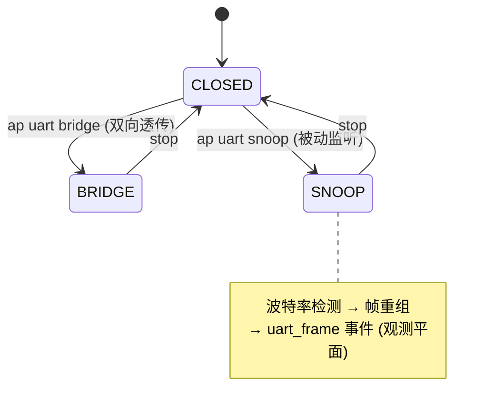

**`uart_bridge` 寄存器(SSOT):** `config` 区 + FIFO。帧重组后以 `uart_frame` 事件进入观测平面,供诊断与日志关联。

**V1 范围:** bridge + snoop、波特率检测、帧重组、`uart_frame` 事件。

## 9. 数据平面

P1 把系统切成两条根本不同的数据流,在 USB 端点、PS 固件、主机软件三层都保持独立。

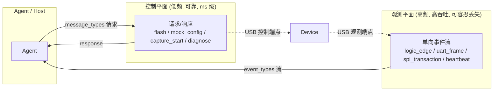

### 9.1 带宽预算（为什么 PL 必须预处理）

| 数据源 | 原始速率 | 约束 |
|--------|---------|------|
| 16ch @ 100MHz 原始采样 | ~200 MB/s | 远超 USB |
| USB 2.0 HS 实际吞吐 | ~40 MB/s | 硬上限 |

原始观测数据比 USB 带宽高一个数量级,因此 P4 要求 PL 端完成**触发过滤 + 变化沿压缩 + 协议解码**,只把语义事件(而非原始波形)送上 USB。控制平面流量极小,优先保证可靠不丢。

### 9.2 USB 端点映射

| 端点 | 平面 | 类型 | 内容 |
|------|------|------|------|
| 控制 OUT/IN | 控制平面 | bulk,请求/响应 | `*_request` / `*_response` |
| 观测 IN | 观测平面 | bulk,单向流 | `event_types` 事件 |
| DAP bulk | 控制平面 | CMSIS-DAP v2 标准 | SWD/烧录 |

---

## 10. 契约层（SSOT）

契约层是 Agent 真正依赖的东西(P2 + P6)。它从 SSOT 生成,跨域 hash 强校验,版本化演进。

### 10.1 生成与强校验流程

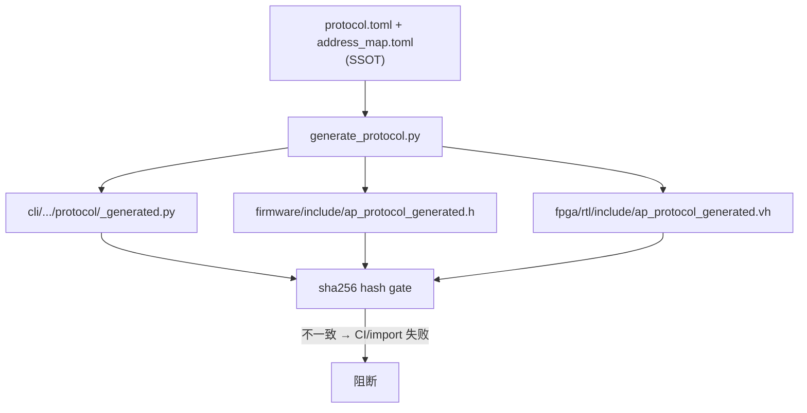

`protocol.toml` 拥有跨域常量:`message_types`、`event_types`、`error_codes`、`terminal_states`、`roles`、`confidence`、`state_changing_actions`、各 schema `versions`。生成的三域常量经 sha256 校验,任何一域漂移即 CI 或 import 失败。

### 10.2 Evidence Envelope 数据模型（去冗余, v0.2.0）

v0.1.0 的 evidence schema 把设备身份重复存了三处(顶层标量 + `*_role` + 嵌套对象)。v0.2.0 **去冗余**:身份只存于 `source_device` / `target_device` 嵌套对象。

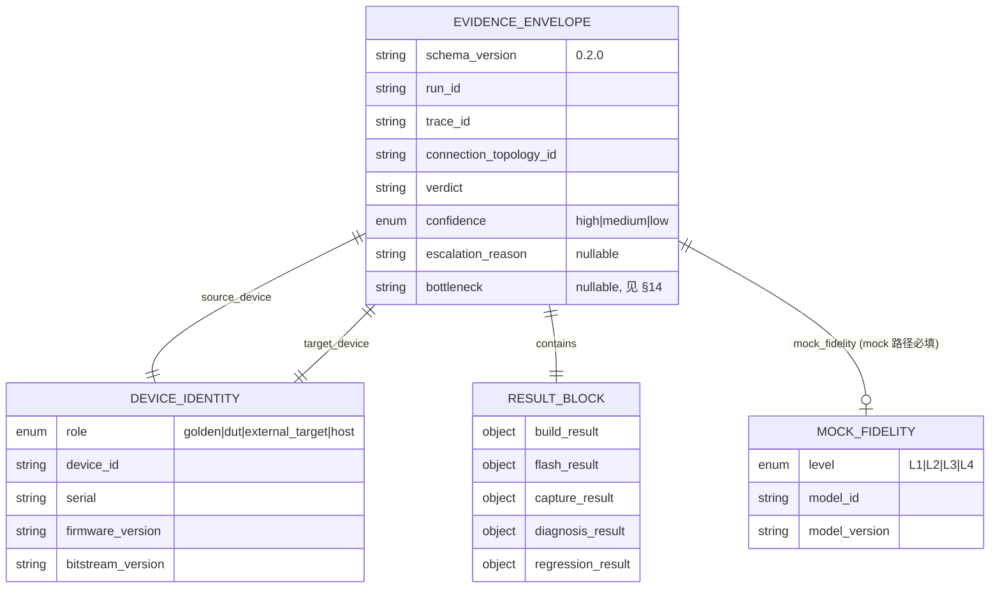

**v0.1.0 → v0.2.0 变更:** 删除顶层冗余 `device_id`/`serial`/`firmware_version`/`bitstream_version` 与 `source_device_role`/`target_device_role`;新增可选 `bottleneck`(枚举)与 `mock_fidelity`(mock 路径必填)。

### 10.3 终态状态机

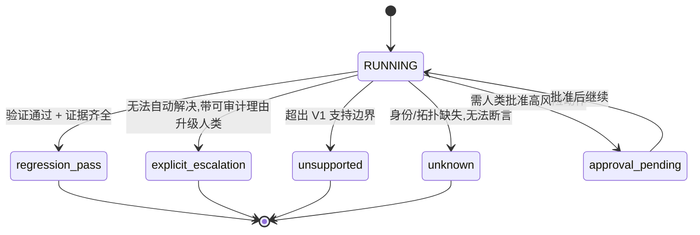

这 5 个终态是 `protocol.toml` 的 `terminal_states`,被 Python `Literal`、outcome schema `enum`、固件 enum 共同约束。

### 10.4 Identity & Topology 与状态变更守卫（P5）

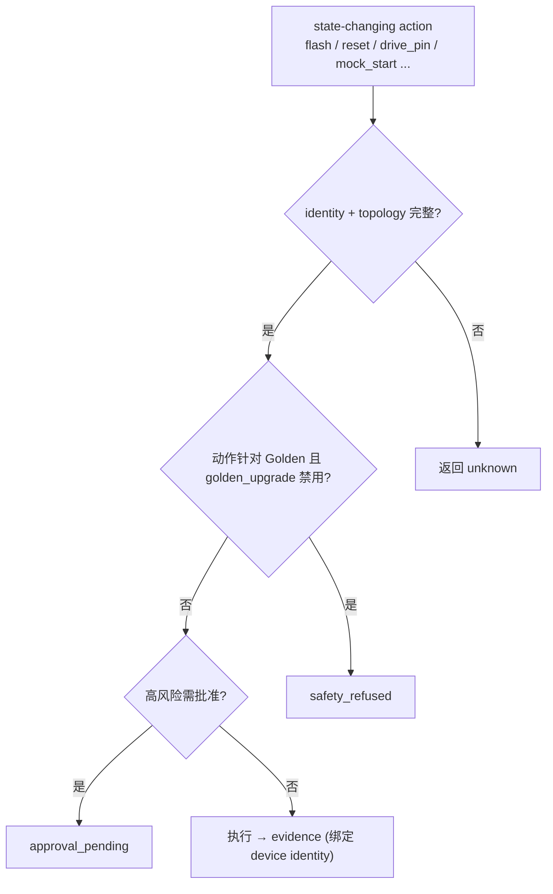

`topology.schema.json` 定义 `connection_topology_id`、`devices`(role/device_id/serial/fw/bs version/`golden_upgrade_allowed`)、`connections`(from/to/signal/purpose)、`allowed_state_changing_actions`。`golden_upgrade_mode` 默认 `disabled`。

### 10.5 错误码 taxonomy

| code | 名称 | 含义 |
|------|------|------|
| 0 | ok | 成功 |
| 100 | invalid_request | 请求格式非法 |
| 101 | schema_mismatch | schema 版本/结构不匹配 |
| 102 | unsupported_boundary | 超出支持边界 |
| 103 | unknown_device_identity | 设备身份缺失/未知 |
| 104 | topology_mismatch | 拓扑不匹配 |
| 105 | approval_required | 需人类批准 |
| 106 | safety_refused | 安全护栏硬拒绝 |
| 200 | transport_error | 传输错误 |
| 201 | device_timeout | 设备超时 |
| 500 | internal_error | 内部错误 |

## 11. Self-Hosting Loop

V1 North Star:Golden AgentProbe 帮助 Agent 开发并验证 DUT AgentProbe。

### 11.1 双板拓扑

```mermaid
flowchart LR
    subgraph host["Host PC"]
        cli["ap CLI + daemon"]
    end
    subgraph golden["Golden AgentProbe (稳定, 不可自动升级)"]
        g["PS + PL"]
    end
    subgraph dut["DUT AgentProbe (开发中)"]
        d["PS + PL"]
    end

    cli <-->|USB| g
    g -->|SWD: 烧录/复位/halt| d
    g -->|UART snoop: 读日志| d
    g -->|8ch logic capture: 观测信号| d
    g <-->|SPI: mock/观测| d
```

Golden 是可信测量/烧录/观测工具,其 firmware/bitstream version 显式锁定,`golden_upgrade_allowed=false`。所有针对 DUT 的状态变更都绑定 DUT identity + topology(P5)。

### 11.2 端到端时序

```mermaid
sequenceDiagram
    participant A as AI Agent
    participant C as ap CLI / daemon
    participant G as Golden AgentProbe
    participant D as DUT AgentProbe

    A->>C: 修改 DUT 固件/PL 实现
    A->>C: ap build
    C-->>A: build_result
    A->>C: ap flash --target dut
    Note over C,G: P5 身份门控 (identity+topology)
    C->>G: SWD 烧录
    G->>D: program + reset run
    G-->>C: flash_result
    A->>C: ap capture / uart snoop
    C->>G: 配置观测
    G->>D: 采集信号 + 读日志
    G-->>C: logic_edge / uart_frame / spi_transaction 事件
    A->>C: ap diagnose
    C-->>A: diagnosis_result + bottleneck
    alt 验证通过
        C-->>A: regression_pass + Evidence Envelope + report
    else 无法自动解决
        C-->>A: explicit_escalation + 可审计证据
    end
```

每条闭环至少覆盖 **1 条正常路径 + 1 条异常/失败路径**,两者都产出可审计结论或明确升级理由。

---

## 12. 演化与分层

> **权威分层见 [§15](#15-ai-native-服务分层与演化座位)(六层服务栈)。** 本章只讲**演化路线**:沿时间轴哪些稳定、哪些可替换。早期文档里的 Layer A/B/C/D 现已并入 §15,对应关系见下表。

核心约束(P6 + P9):Agent 依赖的契约缝从 V1 起稳定,硬件实现层随时可换。

```mermaid
flowchart LR
    subgraph stable["从 V1 起稳定 (永不破坏)"]
        s1["语义契约缝<br/>Capability / Evidence / Verdict"]
    end
    subgraph v1["V1 落地"]
        e1["能力服务层 (headless)"]
        e2["设备抽象层 (Transport + 身份门控)"]
        e3["硬件: Zynq-7020"]
    end
    subgraph future["未来扩展 (缝之上叠加, 不动下层)"]
        f1["推理层: 自研 Agent / RAG / 记忆"]
        f2["知识层: RAG 检索实现"]
        f3["编排: 多设备 / 远程 / 多 Agent"]
        f4["硬件: UltraScale+ / Cloud FPGA"]
        f5["通信: 网络 binding (gRPC/REST/WS)"]
    end
    s1 --> v1
    s1 -.->|叠加| future
```

**旧 Layer A/B/C/D → §15 六层对应:**

| 旧分层 | §15 对应层 | V1 状态 |
|--------|-----------|---------|
| Layer A — Agent Contract | 稳定语义契约(缝) | ✅ 落地(§10、§15.2) |
| Layer B — Orchestration | 编排(推理层旁路,多设备/远程/多 Agent) | ⛔ V1 不实现,接口预留(`device_id` 参数等) |
| Layer C — Device Abstraction | 设备抽象层 | ✅ 落地(Transport + topology + daemon) |
| Layer D — Hardware | 硬件层 | ✅ Zynq-7020;抽象使后续替换不破坏上层 |

**V1 现在就做对的事:** 能力面/推理面分离(P9)、Transport 抽象、契约 transport-agnostic、知识资产可归一、所有 outcome/evidence 带 `device_id`、capability boundary 声明、AXI 地址留 gap、`protocol.toml` 带 version。**V1 不做:** 自研推理层、RAG 检索、MCP Server 之外的网络服务、Remote Lab、Multi-Agent、换 FPGA、USB 3.0。

## 13. 仓库目录 → 模块映射

| 路径 | 架构角色 | 关键内容 |
|------|---------|---------|
| `cli/src/agentprobe/cli/` | 命令面 | Click app、options |
| `cli/src/agentprobe/formatters/` | 输出 | human / json 渲染 |
| `cli/src/agentprobe/protocol/` | 契约 | `_generated`(SSOT 生成 + hash 校验) |
| `cli/src/agentprobe/contracts/` (models) | 契约 | Outcome/Evidence/Topology/Scenario/MockModel |
| `cli/src/agentprobe/mock/` | **差异化核心** | 模型加载、Behavior 脚本宿主、fidelity |
| `cli/src/agentprobe/transport/` | 设备抽象 | Transport 接口 + USB/Replay/Mock |
| `cli/src/agentprobe/devices/` | 设备抽象 | 注册表、topology、role 守卫 |
| `cli/src/agentprobe/core/` | 编排 | scenario 引擎 |
| `cli/src/agentprobe/diagnosis/` | 编排 | 诊断 + bottleneck |
| `cli/src/agentprobe/evidence/` | 编排 | envelope / report |
| `cli/src/agentprobe/daemon/` | 传输 | session / 路由 |
| `firmware/` | Device PS | USB、dispatcher、AXI driver、event aggregator、DAP、Mock Command Layer |
| `fpga/` | Device PL | RTL:control/io_router/mock/analyzer/uart/swd;Vivado 脚本、仿真、约束 |
| `hardware/` | Device | SoM baseboard、fixtures、cables |
| `scenarios/` | 契约 | schemas、replay fixtures、模板 |
| `skills/` | Agent 接口 | Skill 文件 + capability boundary |
| `docs/` | 文档 | quickstart、protocol、version-matrix |
| `protocol.toml` / `address_map.toml` | **SSOT** | 跨域常量 + AXI 映射 |
| `ARCHITECTURE.md` | **权威架构** | 本文件 |
| `archive/` | 历史 | 旧 PRD / 架构散文 |

---

## 14. 横切关注点

### 14.1 版本矩阵与 hash 强校验

`docs/protocol/version-matrix.md` 记录契约版本兼容性。三处版本号必须一致:`protocol.toml [versions]` = schema `const` = `ap_shared.h AP_PROTOCOL_VERSION`(当前 **0.2.0**)。生成常量的 sha256 不一致即阻断(P2)。

### 14.2 物理安全护栏

| 护栏 | 实现位置 | 规则 |
|------|---------|------|
| Flash 寿命 | Daemon | 硬拒绝,不可被 Agent 覆盖 |
| 过压 / 过流 | 硬件 + Daemon | 硬拒绝 |
| Golden 自动升级 | Daemon + topology | `golden_upgrade_mode=disabled` 默认,Agent 不可绕过 |

护栏是 `safety_refused`(错误码 106)的来源;工具只报告事实,循环决策归 Agent/Skill 层。

### 14.3 Bottleneck 分类

诊断把闭环受限原因归类,写入 Evidence Envelope 的 `bottleneck` 字段,指导范围决策(避免在物理可观测性不足时过度投资 Agent 推理):

| 标签 | 含义 |
|------|------|
| `observation_gap` | 可观测范围不足 |
| `execution_gap` | 可执行能力不足 |
| `semantic_translation_gap` | 物理→语义翻译质量不足 |
| `agent_reasoning_gap` | Agent 推理能力不足 |
| `support_boundary_gap` | 超出 V1 支持边界 |

闭环能力 = min(推理能力, 可观测范围, 可执行范围, 语义翻译质量)。当瓶颈稳定地落在 `agent_reasoning_gap`(而非前三者)时,才是开启 V3 Agent 推理层工作的信号。

### 14.4 Skill capability boundary

`skills/agentprobe.skill.md` 必须提供机器可读的 `supported_capabilities` / `not_supported` / `planned_capabilities`,防止 Agent 把 roadmap 文本当作可执行能力。社区贡献的 Skill 须过 schema 校验。

---

## 15. AI-Native 服务分层与演化座位

本章是 AgentProbe 的**权威分层**(§12 仅讲硬件实现层可替换,从属于本章)。它回答一个设计问题:如何让"今天服务现成 Agent"和"未来自研 Agent + RAG"共用同一套底座,换大脑不动地基。

核心思想(P9):**能力面(确定、可观测、信息丰富的工具)与推理面(Agent 大脑)用一条稳定语义契约彻底隔开。** 能力核心保持无头、笨、确定;所有智能挂在契约之上、可替换。

### 15.1 六层服务栈

```mermaid
flowchart TB
    subgraph reason["推理层 — 未来自研 (V1 留空, 只定契约缝)"]
        r1["Agent 大脑<br/>(今天: Claude Code / OpenCode)"]
        r2["RAG 检索"]
        r3["长期记忆"]
    end
    subgraph know["知识层 — 现在留座位 (定接口, 不建 RAG)"]
        k1["诊断知识"]
        k2["Mock 模型库"]
        k3["失败目录 (failure catalog)"]
    end

    seam{{"稳定语义契约 (Capability / Evidence / Verdict)<br/>transport-agnostic · 声明式文件 + 证据库为真相源"}}

    subgraph cap["能力服务层 — 现在做 (headless core)"]
        c1["flash 服务"]
        c2["observe 服务<br/>(analyzer + uart)"]
        c3["mock 服务 ★"]
        c4["diagnose 服务"]
    end
    subgraph devabs["设备抽象层 — 现在做"]
        d1["Transport (USB/Replay/Mock)"]
        d2["devices · 身份门控 (P5)"]
    end
    subgraph hw["硬件层"]
        h1["PL · <1μs"]
        h2["PS · <100μs"]
        h3["PC · <10ms"]
    end

    r1 -.->|消费 verdict / 证据| seam
    r2 -.->|检索语料| know
    r3 -.->|读写记忆| know
    know <-->|资产即语料| seam
    seam --> cap
    cap --> devabs
    devabs --> hw

    cli["CLI 客户端"] -.-> seam
    gui["GUI 客户端<br/>(人类监督/分析)"] -.-> seam
    mcp["MCP 客户端<br/>(实时导管)"] -.-> seam
```

| 层 | 状态 | 做什么 |
|----|------|--------|
| **推理层** | V1 留空,只定契约缝 | Agent 大脑、RAG 检索、长期记忆。今天由外部现成 Agent 占位;未来可自研替换。 |
| **知识层** | 现在留座位(定接口,不建 RAG) | 诊断知识、Mock 模型库、失败目录——未来 RAG 的语料底座。现在归一成"可检索知识资产",不实现检索。 |
| **稳定语义契约(缝)** | 现在做 | Capability / Evidence / Verdict。transport-agnostic;真相源是声明式文件 + 证据库,非 RPC。 |
| **能力服务层** | 现在做 | 无头核心:flash / observe / mock / diagnose 四类能力服务。 |
| **设备抽象层** | 现在做 | Transport 抽象 + 设备身份门控。 |
| **硬件层** | 现在做 | PL / PS / PC 三层实时分工(§6)。 |

### 15.2 稳定语义契约(那条缝)

缝由三组契约构成,**全部 transport-agnostic**——只定义"操作语义 + 数据形状",不定义"怎么传"(进程内调用 / 本地 IPC / 网络 API 都是 binding,见 §15.7)。

| 契约 | 内容 | 已落地于 |
|------|------|---------|
| **Capability** | 能做什么、边界、不确定性:`supported` / `not_supported` / `planned`、`mock_fidelity`、`bottleneck` | `skills/`、`protocol.toml`、§14 |
| **Evidence** | 一次运行的可审计证据包:Evidence Envelope(身份/拓扑/各阶段 result/verdict/confidence) | `evidence.schema.json` §10.2 |
| **Verdict / Outcome** | 终态结论:5 个 terminal state + next_action | `outcome.schema.json` §10.3 |

**两个 AI-native 不变量,落在缝上:**

1. **真相源 = 声明式文件 + 证据库,而非任何一次调用。** mock 模型、scenario、topology、routing 都是仓库内版本化文件;命令日志 + 证据包构成审计轨迹。任何 client(含 MCP)的一次调用都是易失的视图,文件和证据库不是。这让未来自研 Agent / RAG 读的是同一批文件和证据,**不被任何单一协议绑死**。
2. **输出为 context window 设计,不为人眼设计。** 缝交付的是 `verdict + 证据摘要 + attention hint`,不是原始波形。原始数据进 artifact store 按需引用,不默认灌进推理层。

### 15.3 客户端平级(CLI / GUI / MCP)

三个客户端都绑定到同一条缝,语义对齐,没有主从:

| 客户端 | 角色 | V1 状态 |
|--------|------|---------|
| **CLI** (`ap`) | Agent 与工程师的主入口;骨架 + 记忆(文件/证据落盘) | ✅ V1 主路径 |
| **GUI** | **人类监督/分析客户端**:只读观测、证据审阅、审批高风险动作。与 Agent 平级消费同一契约,**非产品本体** | 保留,可选实现 |
| **MCP** | 实时导管(类型化、可发现),live loop 里最顺手的神经;**一种 transport binding,而非 the API** | 顺手支持 |

> **MCP 的定位结论:** 因为真相源是文件 + 证据库(§15.2),MCP 只是"接入 capability service 的一种 transport"。它读的是同一批文件和证据,所以自研 Agent + RAG 时不被 MCP 协议绑死——这正是"MCP 只不过是顺手支持的事情"的架构依据。

### 15.4 知识层归一(RAG 语料底座)

现在诊断知识在 `diagnosis`、Mock 模型在 `mock`、Skill 在 `skills`——是散的。它们恰恰是未来 RAG 要检索的语料。**本层现在只做一件事:把它们归一成"可检索知识资产",定一个统一接口,不实现检索。**

```mermaid
flowchart LR
    subgraph assets["知识资产 (版本化文件)"]
        a1["诊断知识<br/>(规则 / 案例)"]
        a2["Mock 模型库<br/>(MockModel files)"]
        a3["失败目录<br/>(failure catalog)"]
    end
    iface["KnowledgeStore 接口<br/>list() / get(id) / search(query)*"]
    rag["RAG 检索<br/>(未来挂载)"]
    a1 --> iface
    a2 --> iface
    a3 --> iface
    iface -.->|"search() 现在返回 NotImplemented<br/>未来由 RAG 实现"| rag
```

- **现在做:** 知识资产都以版本化文件存在,定义 `KnowledgeStore` 接口(`list` / `get` / 朴素 `search`)。诊断、mock 配置直接走这个接口取数据。
- **现在不做:** 向量化、embedding、语义检索。`search()` 先给朴素实现或 `NotImplemented`,未来 RAG 直接替换该接口实现,上层不动。
- **收益:** 未来自研 RAG 时,语料已经归一、已经版本化、已经有统一取数口,不用先做一轮数据治理。

### 15.5 推理层座位(V1 留空)

推理层是"Agent 大脑 + RAG + 长期记忆"。**V1 不实现**,但缝已经为它定好接入方式,今天由外部现成 Agent(Claude Code / OpenCode)占位。

| 座位 | 今天 | 未来自研时 |
|------|------|-----------|
| **大脑** | 外部 Agent 经 CLI/MCP 消费 verdict + 证据 | 自研 Agent 绑同一条缝,换 client 不换契约 |
| **检索** | 无(知识层 `search()` 朴素实现) | RAG 实现 `KnowledgeStore.search()` |
| **记忆** | 无(每次运行靠证据库 + 文件复原上下文) | 长期记忆服务读写知识层,沉淀跨 session 经验 |

判断"何时该建推理层"的信号来自 §14.3 bottleneck:当瓶颈稳定地落在 `agent_reasoning_gap`(而非 observation/execution/semantic 三者)时,才是投资自研推理层的时机。在那之前,投入应放在能力服务层把可观测/可执行/语义翻译做厚。

### 15.6 现有模块 → 六层投影

§5.2 的 11 个 Python 模块投影到本章六层,确认现有代码结构与新分层一致(无需推倒重来):

| 六层 | 承载模块(§5.2) | 备注 |
|------|------------------|------|
| 推理层 | (外部 Agent) | V1 无自研模块 |
| 知识层 | `skills` + 未来 `knowledge/` | 当前散落于 `diagnosis`/`mock`/`skills`,§15.4 归一时新增 `knowledge/` 取数接口 |
| 契约缝 | `contracts`、`protocol`、`formatters` | 数据契约 + 生成常量 + 双轨渲染 |
| 能力服务层 | `core`、`mock`、`diagnosis`、`evidence` | 四类能力服务的实现 |
| 设备抽象层 | `transport`、`devices`、`daemon` | Transport + 身份门控 + session |
| 硬件层 | `firmware`(PS)、`fpga`(PL) | §6 |

> **唯一的结构性新增是 `knowledge/`**(§15.4 接口),且仅在归一知识资产时引入;其余模块原地归位。这验证了当前架构对"未来 agent + RAG"是演化友好的,不是推倒重来。

### 15.7 通信演化(transport-agnostic 的兑现)

缝是 transport-agnostic 的,所以通信方式是可替换的 binding,**换 binding 不动上面四层**:

```mermaid
flowchart LR
    seam{{"稳定语义契约 (缝)"}}
    subgraph now["近期 (本地优先)"]
        ipc["本地跨进程 IPC<br/>(daemon localhost)"]
    end
    subgraph later["未来 (按需)"]
        net["网络 API<br/>(gRPC / REST / WebSocket)"]
        mcpb["MCP binding"]
    end
    seam --> ipc
    seam -.->|只换 binding| net
    seam -.->|只换 binding| mcpb
```

- **近期:** 本地优先,用本地跨进程 IPC(daemon 在 localhost)先覆盖。可见的未来都跑在同一台机器上。
- **未来:** 若需远程/网络,新增网络 binding(gRPC/REST/WS)或 MCP binding,**契约与能力/设备/硬件层不变**。
- **设计纪律:** 能力服务接口规范刻意**不写死通信方式**,只定操作语义 + 数据契约;binding 层独立演进。这就是"先用跨进程通信覆盖,后续重构通信也可以"的架构保证。

---

_本架构 v0.2.0 与契约 v0.2.0 对齐。历史产品/架构资料见 [`archive/`](archive/README.md)。_


